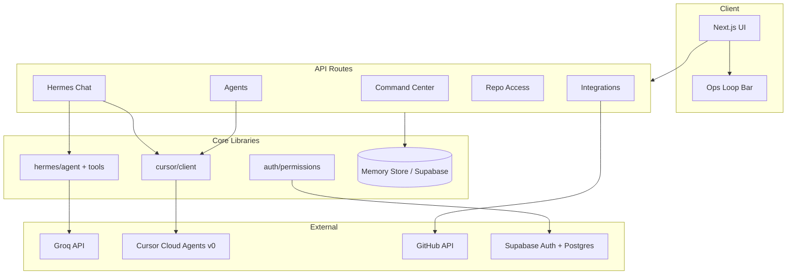
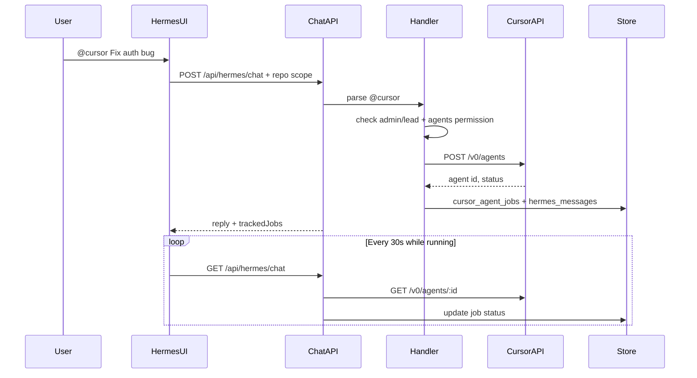

# Architecture

KrakenLab Harness is a **Next.js App Router** application that acts as a company operating system: multi-repo telemetry, AI assistant (Hermes), Cursor agent delegation, team permissions, and integrations.

## High-level diagram



## Layers

### Frontend (`src/app`, `src/components`)

- **App Router** pages under `src/app/(harness)/`
- **Ops loop** shell: Observe → Analyze → Act → Audit (`ops-loop-bar`, `context-strip`)
- Client components fetch JSON from `/api/*`

### API routes (`src/app/api`)

| Route | Purpose |
|-------|---------|
| `/api/command-center` | Aggregated repo metrics |
| `/api/hermes/chat` | Groq chat + `@cursor` interception |
| `/api/hermes/webhook` | External Hermes channel |
| `/api/agents` | Cursor delegation (Agents UI) |
| `/api/access/repos` | Repo permission matrix |
| `/api/session` | Role + capability flags |
| `/api/integrations/*` | Provider sync |

### Core libraries

| Path | Role |
|------|------|
| `src/lib/hermes/` | Groq via Vercel AI SDK, tools, `@cursor` handler |
| `src/lib/cursor/` | Cursor v0 API launch + status sync |
| `src/lib/auth/` | Session, repo ACL, delegation gates |
| `src/lib/store/memory-store.ts` | In-memory runtime (demo/tests) |
| `supabase/migrations/` | Postgres schema for production |

### AI providers

| Provider | Usage |
|----------|--------|
| **Groq** | Hermes chat (`GROQ_API_KEY`, `@ai-sdk/groq`) |
| **Cursor** | Cloud coding agents (`CURSOR_API_KEY`) |
| OpenRouter | Cost/usage sync only (not chat) |

## `@cursor` delegation flow



**Note:** The Agents UI uses `POST /api/agents` directly. Hermes uses `handleHermesCursorCommand()` which calls `delegateToCursor()` in-process. The HTTP guard `blockHermesDelegation` only blocks the Agents API when called with `x-harness-source: hermes`.

## Auth model

- **Supabase** sessions (or `HARNESS_DEMO_MODE` admin)
- **Roles:** admin, lead, dev, viewer
- **Repo actions:** read, write, agents, deploy, secrets (`repo_access` table)
- **Delegation:** admin/lead + `agents` on target repo

## Deployment

- **Vercel** (recommended) for Next.js
- **Supabase** for Postgres + auth
- Env vars from `.env.example`

## Testing

```bash
pnpm test    # Vitest — auth, Hermes, cursor, API contracts
pnpm build   # Typecheck + production build
```
