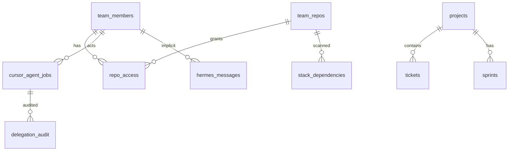

# Database schema

Production schema lives in `supabase/migrations/`. The app currently uses an **in-memory store** (`src/lib/store/memory-store.ts`) for demos/tests; types are in `src/lib/types.ts`.

## Migrations

| File | Contents |
|------|----------|
| `001_harness_schema.sql` | Core domain tables |
| `002_integrations_invites_auth.sql` | Integrations, invites, OAuth |
| `003_v1_permissions.sql` | Repo ACL, delegation audit, Gantt dates |

## Entity relationship (core)



## Tables (by domain)

### Team & access

| Table | Key columns |
|-------|-------------|
| `team_members` | id, name, email, role, auth_user_id |
| `team_repos` | id, name, url, allowed_actions, budget_usd_monthly |
| `repo_access` | member_id, repo_id, actions (JSONB array) |
| `team_invites` | token, email, role, project_ids |
| `team_budgets` | category, monthly_limit_usd, spent_usd |

**Repo actions enum:** read, write, agents, deploy, secrets

### Delivery

| Table | Key columns |
|-------|-------------|
| `projects` | slug, status, progress, repo_url, stack |
| `sprints` | project_id, goal, dates, ticket_ids |
| `tickets` | project_id, sprint_id, status, priority, start_date, due_date |
| `activity_events` | entity_type, entity_id, action, summary, actor_id |

### Stack & costs

| Table | Key columns |
|-------|-------------|
| `stack_dependencies` | repo_id, name, category, version, status |
| `provider_costs` | provider, monthly_budget_usd, actual_spend_usd |

### Hermes & agents

| Table | Key columns |
|-------|-------------|
| `hermes_messages` | channel (in_app/webhook), role, content, context_type, context_id |
| `cursor_agent_jobs` | type, title, prompt, status, cursor_agent_id, pr_url, repo, actor_id |
| `delegation_audit` | job_id, actor_id, repo_url, prompt_hash, status, pr_url |

**Job types:** feature, bugfix, refactor, merge_conflict, issue, pr

**Job statuses:** queued, running, completed, failed, cancelled

### CRM (retained, hidden from V1 nav)

| Table | Key columns |
|-------|-------------|
| `crm_contacts` | company, status, hermes_insight |
| `crm_deals` | contact_id, stage, value_usd, probability |

### Integrations

| Table | Purpose |
|-------|---------|
| `integration_connections` | Provider status |
| `openrouter_usage_snapshots` | OpenRouter spend history |
| `github_repo_links` | Synced repo ↔ project mapping |

## RLS

All tables enable **Row Level Security** with authenticated read/write policies in migrations. Server routes enforce additional **repo-level** checks via `src/lib/auth/permissions.ts`.

## Hermes message linking

When `@cursor` delegates:

- User message stored in `hermes_messages`
- Assistant message with `context_type = 'agent_job'`, `context_id = <job.id>`
- Job row in `cursor_agent_jobs` with optional `cursor_agent_id` from Cursor API

## Applying migrations

```bash
# Via Supabase CLI (when linked)
supabase db push

# Or run SQL files manually in Supabase SQL editor
```
